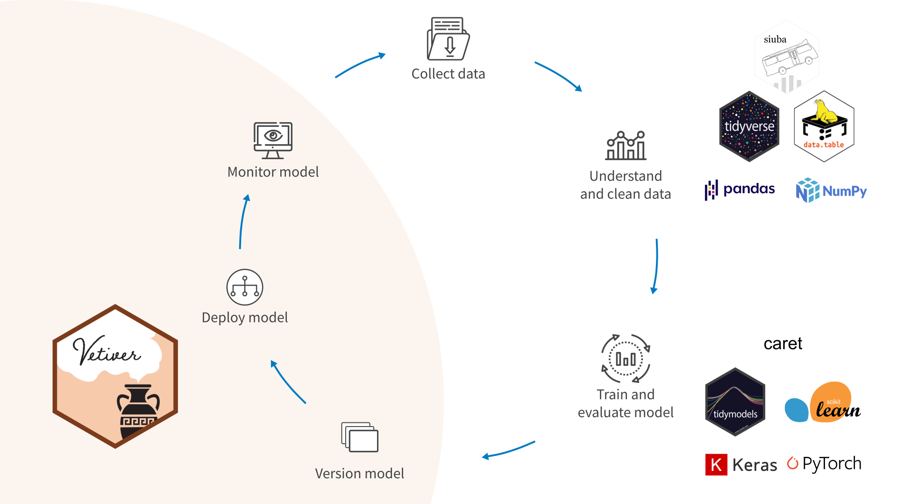
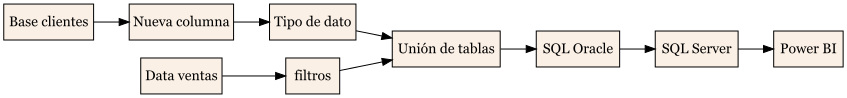

## 📥 Descargas

```{=html}
<div style="margin-bottom: 20px; display: flex; gap: 10px;">
  <a href="trabajo.pdf" class="btn btn-primary" role="button" style="padding: 8px 16px; border-radius: 4px; background-color: #0d6efd; color: white; text-decoration: none;">📄 Descargar PDF</a>
  <a href="trabajo.qmd" class="btn btn-secondary" role="button" style="padding: 8px 16px; border-radius: 4px; background-color: #6c757d; color: white; text-decoration: none;">💾 Descargar Fuente</a>
</div>
```

---

# Enlaces del profesor

🔗 [https://segana.netlify.app](https://segana.netlify.app)

🐙 [https://github.com/sebaegana](https://github.com/sebaegana)

💼 [https://www.linkedin.com/in/sebastian-egana-santibanez/](https://www.linkedin.com/in/sebastian-egana-santibanez/)

---

# Proyecto del curso

## Alcance

Debe desarrollar un proyecto que solucione un problema de negocio financiero en base a código y herramientas en R, ya sea real o hipotético. En cualquiera de las dos situaciones debe realizar una descripción detallada del problema.

## Explicación

Como analista, se generan soluciones a problemas de negocios, y no "el cálculo de" o "el dato de". En este sentido, en el contexto de las organizaciones el trabajo debe estar orientado a proveer soluciones de negocio de largo plazo.

```{r out.width = "70%", eval=TRUE, message=FALSE}
knitr::include_graphics("trabajo/data-science-explore.png")
```

En donde la comunicación corresponde a la solución al problema de negocios.

Más en el detalle, debemos tener la siguiente visión dentro de nuestros desarrollos:

```{r out.width = "100%", eval=TRUE, message=FALSE}

```

Considere las siguientes explicaciones para el desarrollo de su modelo:

1.  Collect data: corresponde a los procesos de extracción de datos, considerando toda las distintas fuentes utilizadas.
2.  Understand and clean data: se relaciona con los procesos de limpieza y transformación de datos del proceso.

PD: ambos procesos anteriores pueden considerar la unión de tablas.

3.  Train and evaluate model: proceso relacionado con el entrenamiento del modelo y evaluación de métricas relevantes para el modelo.

4.  Version model: en caso de existir versiones del modelo

5.  Deploy model: despliegue y entrega del modelo

6.  Monitor model: revisión constante de métricas del modelo, como también de la operatividad del mismo

Veamos el siguiente ejemplo para el punto 1 y 2, para un modelo que no considera modelamiento avanzado:

```{r fig.align = 'center', out.width = "150%", echo=FALSE, message=FALSE, eval=FALSE}
library(DiagrammeRsvg)
library(rsvg)

graph <- DiagrammeR::grViz("digraph {
  graph [layout = dot, rankdir = LR]
  node [shape = rectangle, style = filled, fillcolor = Linen]
  rec1 [label = 'Base clientes']
  rec2 [label = 'Nueva columna']
  rec3 [label = 'Tipo de dato']
  rec4 [label = 'Unión de tablas']
  rec5 [label = 'SQL Oracle']
  rec6 [label = 'Data ventas']
  rec7 [label = 'filtros']
  rec8 [label = 'SQL Server']
  rec9 [label = 'Power BI']
  rec1 -> rec2 -> rec3 -> rec4 -> rec5 -> rec8 -> rec9
  rec6 -> rec7 -> rec4
}")

# Export to SVG then PNG
svg <- DiagrammeRsvg::export_svg(graph)
rsvg::rsvg_png(charToRaw(svg), "trabajo/diagrama_etl.png")

```

{width="100%"}

---

## Entregables

Dentro de su trabajo, debe considerar los siguientes entregables:

1.  **Descripción de la solución**: debe explicar qué soluciona, a quiénes impacta (clientes, usuarios, etc.), cómo espera solucionar el problema, periodicidad del desarrollo y alcance (qué considera y qué no considera)
2.  **Planificación del trabajo**: considere el desarrollo de un pequeño descriptor, como también alguna herramientas para visualizar la planificación (carta Gantt)
3.  **MVP**: desarrolle un producto mínimo viable para su solución. Esto incluye el código relacionado
4.  **Documentación**: considere la necesidad de dejar constancia del trabajo desarrollado para su proyecto. Considere la utilización de alguna herramientas para generar diagramas como Bizagi o Visio. Como referencia se pueden utilizar las **Model card** de [Vetiver](https://vetiver.rstudio.com/learn-more/model-card.html), las cuales deben ser complementadas con los apartados de limpieza y transformación de datos
5.  **Despliegue**: describa cómo espera llevar a producción su solución
6.  **Monitoreo**: describa cómo espera realizar el monitoreo de su modelo

## Formatos de entrega

Se generará un repositorio en Github por parte de cada alumno, en donde deben compartir sus entregas diferenciadas de la siguiente manera:

-   Entrega 01
-   Entrega 02
-   Entrega 03

Cada carpeta debe contener los archivos utilizados para cada entrega que permitan la correcta generación y aplicación del proyecto.

⚠️ Se debe enviar un correo confirmando la subida de los archivos.

⚠️ Es importante tener la consideración sobre la configuración privada del repositorio en caso de ser necesario. En base a la [documentación de Github](https://docs.github.com/en/repositories/creating-and-managing-repositories/about-repositories#about-repository-visibility):

- **Public repositories**: accesibles a todos en internet
- **Private repositories**: solo accesibles a ti y a quienes compartas acceso

⚠️ El repositorio deberá cumplir con la utilización correcta de la librería [renv](https://rstudio.github.io/renv/articles/renv.html)

## Fechas de entrega

### Parte 1

Considera los puntos 1 y 2
**Fecha**: 18 de enero

### Parte 2

Considera el punto 3
**Fecha**: 25 de enero

### Parte 3

Considera todos los puntos anteriores
**Fecha**: 2 de febrero

⚠️ Para todas las fechas, se considera como horario límite las 23:59 de cada día.
